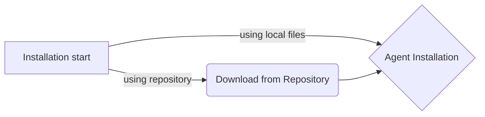

# self-installing-script
This is a self installing script to facilitate installation of agents. Just run the script and it will generate the corresponding directories with the right permissions.

This is basically composed of a shell script that downloads the agents and install on the Linux boxes.

On this current version script works just for Linux, script will only self extract itself, create the right folders under <appdynamics-home> directory and set the right permissions. For network-agent, script will also try to install it using sudo as a Machine agent extension.

There is a lot to do, but this is a socond version of the script.

##Installation flow chart:




## How to use this script

This script has been changed to support any repository using http or local files, it basically downloads the agents from repository straigh to the linux server where the installation is being executed.
1. The production version of the script is located in Repository at:  
2. Transfer that file to the server where the installation is going to be executed
3. Run the script with all the required parameters below
   - Script will donwload the informed agents from repository and start the installation process.

## How to maintain this script

A fully configured version of this script should be uploaded to repository. Every time new agents are released please take the following steps:
1. Download the agents and add them to repository
2. Change the agent_installer.sh
   - Change the variables pointing to the latest agents uploaded to repository
   - No other variables should be changed
3. Upload the latest version of the agent_installer.sh to repository
   - Script should be upload to /Installers under the name of "linux_java_agent_installer.sh"
4. Send this script URL to personal that will perform the installation.


## Known issues | Requirements: 

> 1. Installation will try to configure files automatically. If it fails, it will leave the configuration untouched.
> 2. Script requires 'curl' or 'wget' to download the agents from repository
> 3. For local files use the parameter -Local true, and then put the files in temp_dir="/tmp/appd_temp" as names: java = java-agent.zip, java-bm = java-ibm-agent.zip, machine-agent = machine-agent.zip, cacerts = cacerts.jks
> 4. If you are not using custom certificates, please put the parameter -Cacerts false
> 5. sed -E or sed -r are required.

## Tested Versions

|OS              |VERSION         |
|----------------|----------------|
|Redhat          |`6+`            |
|Centos          |`6+`            |
|Suse            |`11+`           |


## New to this version

1. Parameters are now validated. So invalid parameters will fail gracefully instead of crashing with error.
2. Powershell is not required anymore, script must be transfered to the Linux box. Upon execution script will download the files and proceed with the installation.
3. Installation and configuration of machine agents are more stable, but depending on the Suse version this may require some manual updates to the service
   - Please check that the service has been properly configured with chkconfig and make the appropriate changes, if needed
4. Local files are allowed in tmp dir.
5. Fixes for OS using sed -r and sed -E
6. Fixes for installing services systemd or sysv
7. More logs and some minors fixes.

## Parameters for installation

Bash script now has a some new parameters, order of the parameters do not matter anymore. Some are required and some are optional.


**-AppDAgentList**
```
    Agents to be installed now must be informed using this parameter. Options can be: 'java', 'java-ibm', 'java-jdk8', 'machine', 'network', 'all', 'all-ibm', 'all-jdk8'.
    'network' options requires machine to be also be informed.
    REQUIRED
   ```
   
**-AppDHome**
```
    This parameter is now mandatory, it sets the installation directory. Script will try to create the directory if it does not exists.
    REQUIRED
```
**-MAContURL**
```
    Sets the controller address for the Machine Agent, this won't change configuration for the Java agent, as these should be configured as parameters
    REQUIRED
```
**-MAContport**
```
    Sets the controller port for the Machine Agent, this won't change configuration for the Java agent, as these should be configured as parameters. Values should be integer.
    REQUIRED
```
**-MAContSSL**
```
    Sets the controller SSL options for the Machine Agent, this won't change configuration for the Java agent, as these should be configured as parameters. Values are integer ans should be 0=false or 1=true.
    REQUIRED
```
**-MAContAccessKey**
```
    Sets the controller access key for the Machine Agent, this won't change configuration for the Java agent, as these should be configured as parameters
    REQUIRED
```
**-MAContAccount**
```
    Sets the controller account for the Machine Agent, this won't change configuration for the Java agent, as these should be configured as parameters
    REQUIRED
```
**-MASIMEnabled**
```
    Enables or disables the server visibility for the Machine Agent, values are integer ans should be 0=false or 1=true.
    REQUIRED
```
**-MAHierarchy**
```
    Sets Machine Agent hierarchy, example: "DC 1:Rack 2" or "New York:HQ" or "VMWARE-LEGACY:VMCLUSTER1"
    OPTIONAL
```
**-MAUser**
```
    Sets the user that will run machine agent, if not provided root will be used
    REQUIRED
```
**-MAGroup**
```
    Sets the group that will run machine agent, if not provided will be used the default group for the user.
    REQUIRED
```
**-MAInit**
```
    Sets the init system that will be used. Installer will try to configure them automatically, if it fails configuration can be done manually. Values for this option must be one of these two values: 'sysv' or 'systemd'.
    OPTIONAL
```
**-Local**
```
    Sets the script to use local files. Put the files in temp_dir="/tmp/appd_temp" as names: java = java-agent.zip, java-bm = java-ibm-agent.zip, machine-agent = machine-agent.zip, cacerts = cacerts.jks. Values for this option must be : 'true'.
    OPTIONAL
```
**-Cacerts**
```
    Sets the script to don't use custom cacerts.jks. Values for this option must be : 'false'.
    OPTIONAL
```

Machine Agent startup now is configured upon installation user must choose either systemd or sysv. If the parameter is not informed, installation will proceed without init system configuration. If configuration commands are not present or init system has not been informed a message will be presented to the user, telling that configuration will have to be done manually.

## Usage examples

This will install agent with the designated user and group, using systemd:

```
sudo ./agent_installer.sh -AppDAgentList all -AppDHome /opt/appdynamics/ -MAContURL controller.domain.com -MAContport 443 -MAContSSL 1 -MAContAccessKey dasd-sadas-sdada-hdhdhdhsdsdsds -MAContAccount customer1 -MASIMEnabled 1 -MAUser centos -MAGroup users -MAInit sytemd
```

This will install agent using local files and not using custom cacerts:

```
sudo ./agent_installer.sh -AppDAgentList all -AppDHome /opt/appdynamics/ -MAContURL controller.domain.com -MAContport 443 -MAContSSL 1 -MAContAccessKey dasd-sadas-sdada-hdhdhdhsdsdsds -MAContAccount customer1 -MASIMEnabled 1 -MAUser centos -MAGroup users -MAInit sysv -Cacerts false -Local true
```